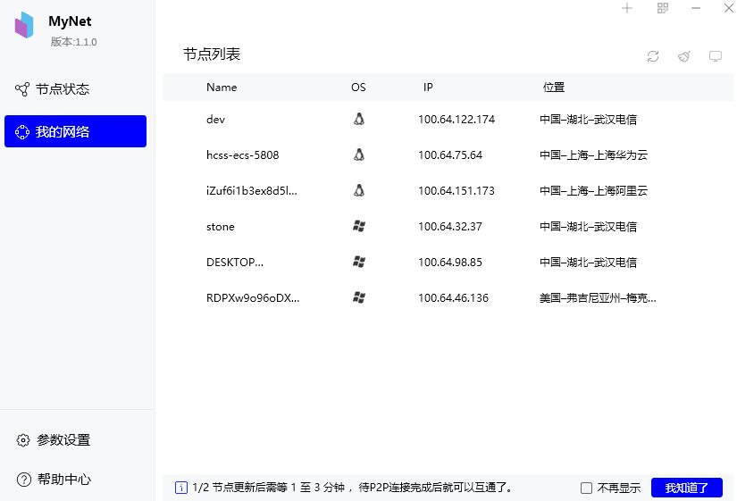
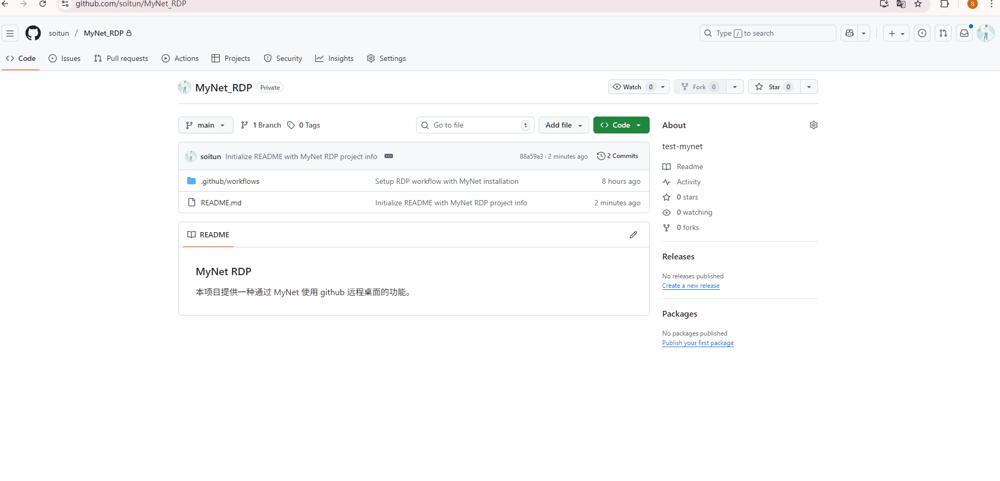

### MyNet RDP

本项目提供一种通过 MyNet 使用 github 远程桌面的功能。 

## 基本条件

1. 前置条件: 客户机为 windows
2. 已安装 MyNet
   
## 使用步骤

### 一、安装MyNet
1. 下载安装 MyNet
   
   点击 [这里](https://mynet.99400.cn/download/mynet_setup.exe) , 下载好 MyNet 后，双击安装就可。 
   

2. 启动 MyNet , 并扫码关联帐号
   可以参考 [在线教程](https://mynet.99400.cn/docs/start-here/getting-started/)

3.  获取 OPENID
   点击 MyNet 右上角的二维码

   

### 二、fork 本项目
1. fork 本项目
2. 修改 OPENID

### 三、启动action

这个过程每个人的长短不一样。耐心等待启动成功就可了。

### 四、用RDP客户端连接
